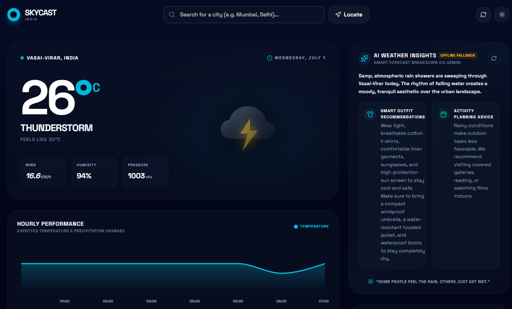

# Weather & AI Advisory Hub

A beautiful, responsive, full-stack weather application powered by **React (Vite)**, **Tailwind CSS**, and **Express**. It integrates intelligent, poetic daily weather summaries and outfits/activities recommendations generated on-the-fly by the **Gemini AI SDK** (supporting `GEMINI_API_KEY` or `GOOGLE_API_KEY`) and real-time atmospheric data via **OpenWeather** (or a seamless, free fallback to **Open-Meteo**).

---

## 🚀 Key Features

- **Dynamic Weather Forecasting**: Real-time ambient data, feels-like temperature, humidity levels, wind speed, and accurate coordinates using Nominatim Geocoding.
- **Intelligent Gemini AI Advisory**: Beautiful, poetic summaries, daily outfit recommendations, outdoor/indoor activities suggestions, and inspiring seasonal quotes.
- **Robust Local Cache & Resilience**: Global server-side caches for geocoding and AI recommendations, ensuring rapid responses and strict protection against API quota limiters.
- **Graceful Fallbacks**: Fully operational even without active API credentials, falling back to rich, custom-curated meteorological advice patterns.
- **Elegant & Responsive Design**: Styled from scratch using premium off-white/charcoal typography pairings, high-contrast layouts, smooth transitions, and a modern aesthetic.

---

## 🛠️ Tech Stack

- **Frontend**: React 18, Vite, Tailwind CSS, Lucide Icons, Motion (Framer Motion)
- **Backend**: Express, TypeScript, TSX, ESBuild
- **Geocoding & Weather**: Nominatim OpenStreetMap API, OpenWeatherMap API, Open-Meteo API

---

## 💻 Local Installation & Setup

Follow these simple steps to run the project locally on your machine inside **VS Code**:

### Prerequisites
Make sure you have [Node.js](https://nodejs.org/) installed (v18 or higher recommended).

### 1. Install Dependencies
Open your VS Code terminal and install all required packages:
```bash
npm install
```

### 2. Run the Development Server
Launch both the Vite frontend compiler and the Express API server in development mode:
```bash
npm run dev
```
The application will boot up at **`http://localhost:3000`**.

### 3. Build for Production
To bundle and compile the application for a fast, optimized production deployment (creating static assets in `dist/` and a bundled server in `dist/server.cjs` via `esbuild`):
```bash
npm run build
```

### 4. Start Production Server
Launch the self-contained production bundle:
```bash
npm start
```

---

## 📂 Project Architecture

```filepath
├── assets/                 # App icons and graphics
├── src/                    # Frontend source code
│   ├── components/         # Modular React components
│   ├── App.tsx             # Main React entry dashboard
│   ├── index.css           # Global Tailwind stylesheet
│   └── main.tsx            # React application mounting
├── server.ts               # Custom Express API Gateway & server-side endpoints
├---variables
├── package.json            # Scripts and dependencies configurations
└── tsconfig.json           # TypeScript configuration details
```

---